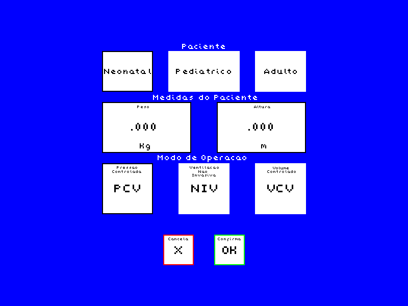
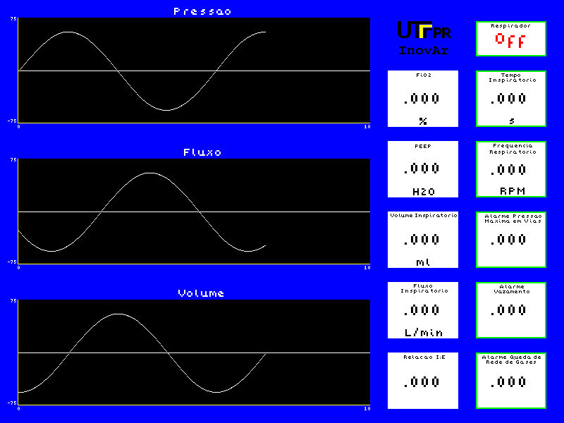

# Ventilador aimmed para COVID-19

Programming project for a ESP32 microcontroler, developed for a ventilator, with the primary aim to provide support against COVID-19. Developed in the name of UTFPR-Apucarana.

# How to utilize

Download the files, and certify that everything is in a folder with the same name as the .ino file (The Arduino IDE complains if that is not the case).

Compile the .ino for ESP32 (You need additional files to compile for this board, it's not included in the base installation of Arduino IDE).

*Recommended ESP32 .json file: https://dl.espressif.com/dl/package_esp32_index.json*

The bellow images shows which pin from the ESP32 should be connected to the VGA connector.

Done! In theory, the microcontroler should display imagens at your VGA monitor.

# Results

Some screens generated from the software:

## Initial parameters screen

Initial system configurations are done at that screen.

## Operation phase screen

This screen is the main operation screen, showing the necessary graphics and numerical data, at the left most column. The right most column defines parameters that can be changed during operation.

## Shutdown/Restart screen

Allows for system shutdown/restart.

# Colaborators

Lucas Zischler

Bruno Gabriel da Silva

